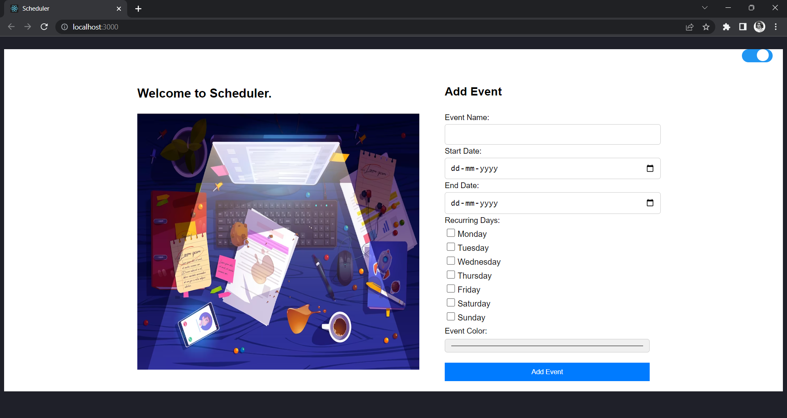
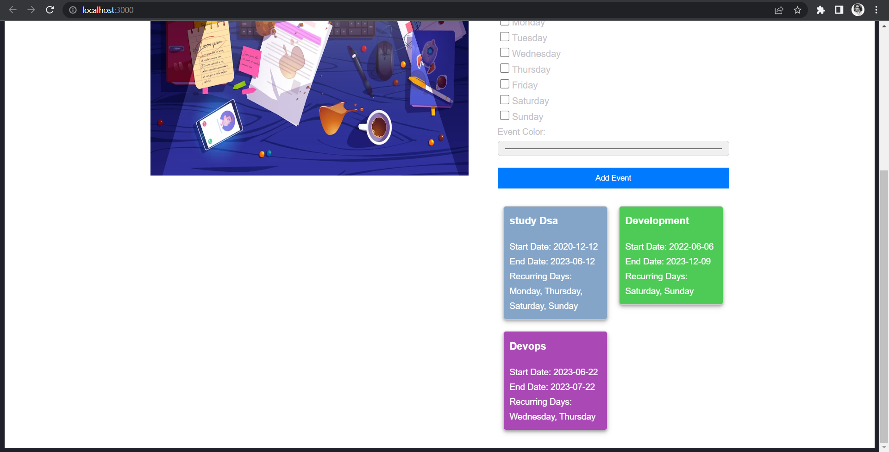

# Scheduler.

The Event Management App is a web application that allows users to manage and organize events. Users can create new events, view existing events, and perform various actions related to event management.

## Features

- Create new events with details such as title, date, time, and description.
- View a list of existing events with their relevant information.
- Toggle between light and dark modes to customize the app's appearance.
- Responsive design to provide a seamless experience on different screen sizes.
- User-friendly interface for easy event management.

## Screenshots







## Technologies Used

- React: JavaScript library for building user interfaces.
- HTML: Markup language for creating the structure of web pages.
- CSS: Styling language for designing the appearance of web pages.

## Getting Started

To get started with the Event Management App, follow these steps:

1. Clone the repository:

   ```bash
   git clone https://github.com/manu31shukla/Scheduled..git
   
2. Install the dependencies:

    ```bash
    cd event-management-app
    npm install


3. Start the development server:
    ```bash
    npm start


4. Open your web browser and visit http://localhost:3000 to access the app.

## Contributing
Contributions are welcome! If you have any ideas, suggestions, or bug reports, please open an issue on the GitHub repository. You can also fork the repository and submit a pull request with your improvements.
